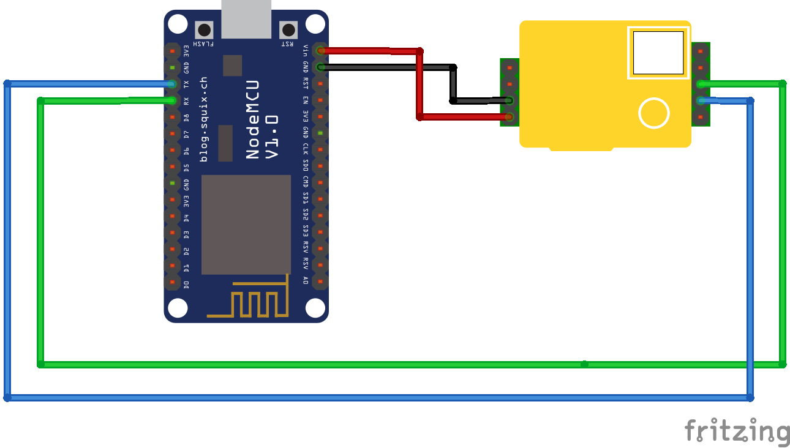

# co2_santiagoapostol
Medidor de CO2 y condiciones ambientales de las aulas del IES Santiago Apóstol

## Construcción:
* Sensor de CO2 MHZ19
* Placa Nodemcu versión 2

## Compilación del software:

Es necesario usar el IDE de Arduino, preparado para compilar software con el esp8266. Hay instrucciones en español en https://www.naylampmechatronics.com/blog/56_usando-esp8266-con-el-ide-de-arduino.html

Una vez preparado el IDE de Arduino es necesario añadir un archivo llamado credenciales.h con las contraseñas necesarias para conectar al broker mqtt, así como las credenciales del punto de acceso Wifi al que se va a conectar.

Librerías de Arduino que hay que instalar :

* https://github.com/arduino-libraries/NTPClient
* https://www.arduino.cc/en/Reference/WiFi
* https://github.com/esp8266/Arduino
* https://pubsubclient.knolleary.net/
* https://github.com/malokhvii-eduard/arduino-mhz19

#include <MHZ19.h>
#include <Arduino.h>
#include <ESP8266WiFi.h>
#include <PubSubClient.h>

## Prototipo construido

## Esquema

## Pinout del MH-z19

